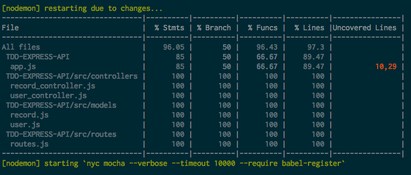
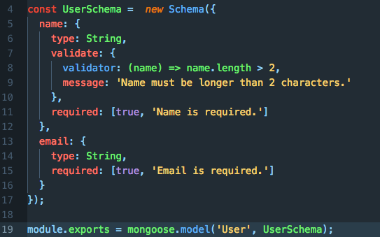
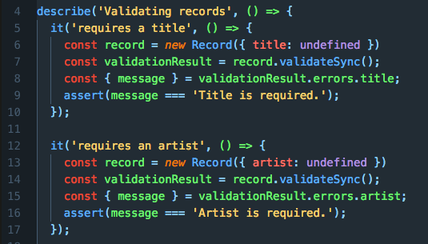
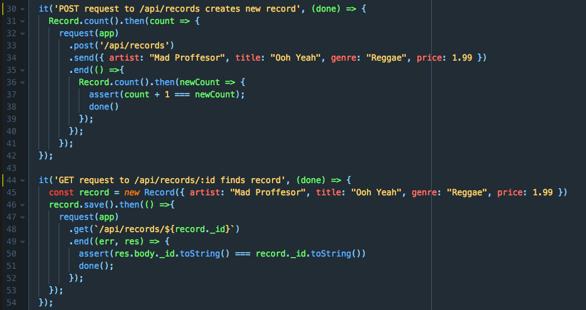

# Record Shop API

An exercise in test driven development, focusing on approaches to testing CRUD routes and MongoDB / Mongoose methods.

The basic premise is an online record store backend with an app which connects to a database to store user and product data. The database consists of two tables: users and records. It is possible to create, find, update and delete from both tables using API requests. It's my intention in future to develop further tables and connect the whole thing to a React app I am developing in parallel.

Mocha is used as the testing framework here. Tests run on both the API routes and Mongoose's direct interactions with the database, ensuring that validations work correctly along with create, show, find, delete and update commands. Test coverage is 100% on each of the controller and route files.

### To run
```
$ git clone https://github.com/joecowton/TDD-EXPRESS-API.git
$ cd TDD-EXPRESS-API
$ npm install
$ npm start
```
### To test
```
$ npm test
```
### Test coverage


### User Schema with validation



### Validation assertions


### API route testing

